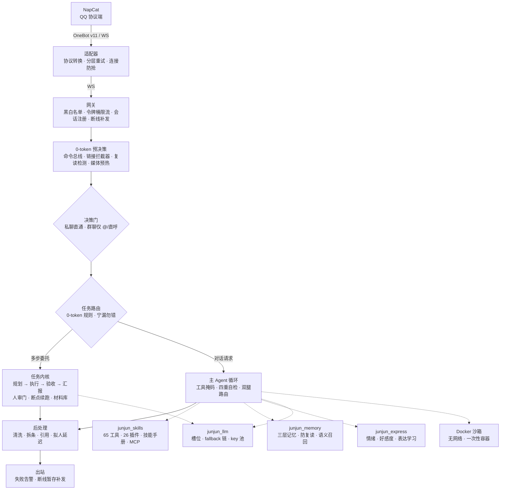
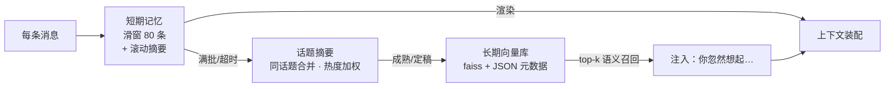

<div align="center">

# JunJun_Agent · 君君

**以 QQ 为前端的通用智能体（Agent）框架**

LangChain 1.x 工具循环 × LangGraph 任务内核 × Docker 代码沙箱 × 三层记忆 × 全链路可观测

[](https://www.python.org/)
[](https://github.com/langchain-ai/langchain)
[](https://github.com/langchain-ai/langgraph)
[](https://www.docker.com/)
[](https://github.com/astral-sh/uv)
[](https://github.com/astral-sh/ruff)
[](#-license)

</div>

---

## 📖 目录

- [特性](#-特性)
- [架构总览](#-架构总览)
- [一条消息的旅程](#-一条消息的旅程)
- [工具系统](#-工具系统)
- [记忆系统](#-记忆系统)
- [任务内核](#-任务内核)
- [代码沙箱与工作区](#-代码沙箱与工作区)
- [可观测性](#-可观测性)
- [安全模型](#-安全模型)
- [模型接入策略](#-模型接入策略)
- [质量保障](#-质量保障)
- [快速开始](#-快速开始)
- [配置说明](#-配置说明)
- [目录结构](#-目录结构)
- [故障排查](#-故障排查)

---

## ✨ 特性

| 特性 | 说明 |
|---|---|
| 🎯 **决策主循环** | LangChain `create_agent` 工具循环；每轮重建绑定、动态工具掩码；意图自检 / 承诺-行动自检 / 防复读 / 空输出兜底四重守门 |
| 🧩 **任务内核（TaskKernel）** | 多步委托状态机：LLM 规划拆步 → 逐步执行+验收 → 失败重试/局部重规划 → 终态主动汇报；LangGraph 断点续跑，进程重启不丢单 |
| 🙋 **人工审批门** | 发布类/沙箱类动作执行前 `interrupt` 挂起，私聊管理员裁决（通知**带实际入参摘要**，不盲批）；超时默认跳过，宁保守不放行 |
| 🐳 **Docker 代码沙箱** | 一次性容器跑数据分析/图表/文档：无网络、只读根文件系统、资源限额、超时硬杀、非 root；非管理员强制走人审 |
| 📁 **文件入口闭环** | 聊天里发 xlsx/csv/pdf → 存进会话工作区 → 沙箱处理 → 结果发回聊天（图片直发、文档传群文件） |
| 🧠 **三层记忆** | 短期滑窗（带滚动摘要）→ 话题摘要 → 向量长期库（写入去重/时效衰减/定期遗忘）；语义召回「你忽然想起」；跨场景隐私边界**机械强制** |
| 🧰 **65 件工具 · 26 个插件** | 搜索/画图/语音/视频理解/订阅盯梢/提醒/工作区文件/跑代码……插件化装载，外加 10 本 Markdown 技能手册按需取用 |
| 🪶 **双腿路由** | 高频闲聊走轻量模型，复杂请求走强模型；带媒体/私聊/管理员消息自动升配——token 花在刀刃上 |
| 🔍 **全链路可观测** | structlog 结构化日志 + 本地轨迹 JSONL + Langfuse span + 用量软告警，观测件失败绝不炸主流程 |
| ✅ **评测驱动开发** | 2000+ 单测全 0-token；golden 决策评测（真实 LLM）；「加宽命中面必配误判回归」铁律 |

---

## 🏗 架构总览

### 进程拓扑

三个进程，职责隔离——QQ 协议端最易掉线，炸了只重启最外层；智能层不感知协议细节，接入新平台只需再写一个适配器：

```
┌──────────┐  OneBot v11   ┌──────────┐   WebSocket    ┌──────────────┐
│  NapCat  │ ◄───────────► │  适配器   │ ◄────────────► │   bot 主程序  │
│ QQ 协议端 │   port 8095   │ 协议转换  │   port 8092    │  网关 + 决策  │
└──────────┘               └──────────┘                └──────────────┘
 napcat_watchdog.py         run_adapter.py               run_junjun.py
```

### 内部分层



### 包职责一览

| 包 | 职责 |
|---|---|
| `junjun_core` | 网关、配置热更、DB（peewee + WAL，22 表）、安全信任根、可观测性、后台任务收口 |
| `junjun_adapter_napcat` | OneBot v11 ↔ 内部协议转换；发送分层重试；心跳看门狗 |
| `junjun_agent` | 决策漏斗、主 Agent 循环、persona 组装、任务路由、后处理、调度器/提醒/异步队列 |
| `junjun_agent/task_kernel` | 复杂任务状态机：LangGraph 引擎（断点续跑 + 人审 interrupt）与 legacy 双引擎灰度 |
| `junjun_llm` | 任务槽模型工厂：每槽多模型 fallback 链 + 多 key 号池轮用 |
| `junjun_memory` | 三层记忆、防复读、知识图谱、跨场景档案、向量化 |
| `junjun_skills` | 工具注册表（三层包装 + 三层掩码）、插件加载器、26 个插件、技能手册 |
| `junjun_express` | 情绪、好感度、表达学习、自我认知、黑话 |
| `junjun_mcp_client` / `junjun_mcp_server` | MCP 双向：调外部 server + 对外提供自建 server |
| `junjun_webui` | FastAPI 管理台：配置热改 / 日志实时流 / 统计 / 数据管理 |
| `sandbox/` | 沙箱编排服务（FastAPI）：每跑一次起一个一次性容器 |

**依赖方向只往下**：层间走数据契约（`InboundMeta` / `ReplySet`），core 不 import 上层（处理器注入模式）。

---

## 📨 一条消息的旅程

```
入站                                                   出站
════                                                   ════
NapCat → 适配器 → 网关 handle_inbound                  agent 产出文本
  │                                                       │
  ├─ 闸门 1  黑白名单（每条重建配置，热改立即生效）          ├─ 诚实校验（声称↔工具台账）
  ├─ 闸门 2  令牌桶限流（每会话 8/0.5 每秒）                ├─ 写记忆 + 落库
  ├─ 提取消息段（文本/图/语音/视频/文件/表情包）            ├─ 后处理：剥思考块 → 清洗
  ├─ 闸门 3  屏蔽名单（照收照存，不做决策）                 │        → 语气词/emoji 闸门
  ▼                                                       │        → 拆条（单条 ≤120 字）
会话队列（每会话一个 worker）                              ├─ 逐气泡发送 + 拟人打字延迟
  ├─ 排水合并：积压多条 → 一批一次决策                     ├─ 失败 → 告警 + outbox 暂存
  └─ 目标选择：「最新一条 @ 了 bot 的」优先                ▼
  ▼                                                适配器分层重试
0-token 预决策（不花模型额度干完的家务）              （确定性失败直补；疑似误报先
  命令总线 → 链接拦截器 → 偷表情包 → 复读检测            查历史确认再补，防刷屏）
  → 话题摘要记账 → 媒体预热（VLM/ASR 后台解析）
  ▼
闸门 4  决策门：私聊直通；群聊只认 @ 或叫昵称
  ▼
任务路由：多步委托 → 任务内核；其余 → 主 Agent 循环
```

两个结构性设计：

- **回复不走路径返回**：发送在处理函数内部完成，管道「进去就到底」。
- **沉默是一等公民**：`do_not_reply` 工具、复读沉默、思考链泄漏沉默、空输出
  兜底……每一层都有明确的「不说」出口；而被 @ 必回的场景会**结构性移除**
  沉默工具（提示词里写「禁止调用」只是劝告，从绑定列表拿掉才是保障）。

---

## 🧰 工具系统

### 三层包装（注册即套上）

1. **参数纠偏**：宽松类型兼容（弱模型把数字传成字符串也能救）。
2. **管理员门**：`admin_only` 工具在工具体内硬校验调用者身份，不依赖提示词自觉。
3. **结构化错误反馈**：异常转成 `[TOOL_ERROR kind=...]` 文本返回给模型
   （网络/限流/参数/权限分类 + 行动建议），让模型能自救而非整轮崩溃。

### 三层动态掩码

65 件工具全量塞给模型会稀释注意力、烧 token，所以**每轮**按上下文动态裁剪：

| 层 | 机制 |
|---|---|
| CORE | 永远在线的基本功（搜索/记忆/提醒/不回复等 9 件） |
| INTENT 意图组 | 按关键词命中挂载（「画」→ 画图组；「订阅/盯着」→ 订阅组） |
| TOPIC 钉词 | 最近几条上下文的主题把相关工具钉住，话题不掉线 |
| 兜底 | 掩码后不足 8 件时按通用度补齐 |

配套设计：agent **每轮重建**工具绑定——掩码随话题变化，一次性绑定的方案
会让被裁掉的工具永远回不来。裁错了也有补救：意图自检发现「该调的没调」
会带全量工具追问重试一轮。

### 插件与技能手册

- **插件**：一个目录一件插件，`_manifest.json` 声明名称/模块/工具属性/
  会话白名单/权限；可选 `probe_available()` 钩子让缺依赖的插件优雅禁用
  而非炸启动。现有 26 个：搜索、画图、语音合成、B 站/抖音视频、订阅、
  日报、工作区、QQ 空间、娱乐等。
- **Markdown 技能手册**：10 本手册（`agent_skills/*.md`），system prompt
  里只放索引，命中场景时模型调 `use_skill` 取全文——低频知识移出常驻
  prompt，用时再取。
- **MCP**：客户端注入外部 MCP server 工具；自建 server 对外暴露内部能力。

---

## 🧠 记忆系统



- **短期记忆**：滑窗之外不丢——滑出的行攒够阈值后由后台模型压缩成滚动
  摘要置顶渲染。渲染层做昵称清洗（防注入伪造发言）、连续发言合并、
  自身历史去重（防复读的输入侧闸门）。
- **长期记忆「遗忘经济学」**：写入近义去重合并（相似度 >0.92 加权而非新插）；
  权重每周衰减、检索命中复习强化、钉住记忆不衰减；召回阈值从严（ embedding
  模型对弱相关中文也给高分，宽阈值等于注入噪声）；夜间合并去重比写入期
  更严——宁漏勿错杀。索引与元数据成对备份，记忆是不可再生资产。
- **语义召回限流**：每会话每小时最多注入数条，命中才占额度；召回域按
  场景隔离——**私聊来源的记忆绝不注入群聊**（单向门，机械强制）。
- **防复读双层**：输入侧渲染去重 + 出口侧相似度拦截（口头禅自动挖掘进
  黑名单）。输出回流输入的系统都有正反馈复读风险，结构问题结构修。

---

## 🧩 任务内核

与主对话循环的本质区别：主对话是「模型自己数工具消息决定何时停」，
任务内核是**代码侧状态机**——步骤完成度由代码按验证结果推进，失败由
代码决定重试/重规划/终止，不靠模型自由发挥。

```
接单话术（模板 0-token，先回话再规划）
   ▼
规划器（无 persona，纯推理槽位）
   ▼
┌─ 执行循环 ──────────────────────────────┐
│ 死线 30min → 就绪步骤并行（副作用步骤串行殿后）│
│ → 逐步验收（schema / llm_judge / human）      │
│ → 首败重试 → 再败局部重规划（指数退避）        │
│ → 否则终止并如实汇报                          │
└───────────────────────────────────────────┘
   ▼
终态汇报（有材料读全文，不拿摘要充数）+ 回填记忆
```

关键机制：

- **人审门**：发布类动作（发说说等）与非管理员的跑代码步骤执行前挂起，
  审批通知**带实际入参摘要**；审批恢复按**任务提交者身份**继续执行
  （不借管理员身份）；超时默认跳过。
- **异步任务防混**：异步工具只返回接单回执，**回执不是材料**——依赖异步
  步骤的下游步骤被传递闭包硬剔除，杜绝「没材料的报告抢先发出」。
- **重规划不丢单**：修订时未显式放弃的步骤保留——宁保留误执行，不静默丢。
- **材料库**：大产出全文落盘，步骤结果只留摘要+指针，合成/汇报按需读回
  ——中间数据留在运行环境，只有最终结果进模型上下文。
- **断点续跑**：LangGraph SqliteSaver 检查点，`thread_id = plan_id`，
  进程重启后注册表逐单恢复；审批挂起的单重建待办并重新通知管理员。
- **护栏中间件**：检索软刹车（每轮搜索上限，用完必须基于已搜集信息作答）、
  重复调用熔断（同参指纹第三次短路）、大结果压缩（头尾预览+全文落工作区）。

---

## 🐳 代码沙箱与工作区

```
聊天里发文件 ──► 登记「最近的文件」 ──► 存入会话工作区（50MB 封顶，SSRF 逐跳检查）
                                          │
                              「统计一下这个表格」
                                          ▼
                          run_code：docker run --rm -i --network=none …
                                          │  pandas / matplotlib / python-docx …
                                          ▼
                          结果发回聊天：图片直发，文档传群文件
```

容器是唯一安全边界，编排层只是辅助：

| 防线 | 配置 |
|---|---|
| 网络 | `--network=none` 完全隔离 |
| 文件系统 | 只读根 fs + tmpfs /tmp（noexec） |
| 资源 | 2C / 2G 限额、30s 硬杀、输出 256KB 封顶、并发信号量 |
| 权限 | 非 root 运行、每跑一次性容器、按会话隔离工作区 |
| 编排层 | workdir 归属断言（挡 `..` 穿越）、共享 token 鉴权、AST 静态预检、非管理员强制人审 |

---

## 🔍 可观测性

四件套分工，共同铁律：**观测件失败绝不炸主流程**（轨迹落盘全路径静默、
日志写异常静默、Langfuse 未配置时链式空操作）。

| 件 | 说明 |
|---|---|
| 结构化日志 | structlog + 控制台/文件双写（自写 Tee 分流，绕开 Windows 跨进程轮转的坑）；本地时区时间戳 |
| 轨迹 JSONL | `data/trajectory/日期.jsonl` 只追加：入站/出站/每轮决策（腿级、工具、prompt 哈希）/任务内核全事件——事后能还原「模型当时看到了什么」 |
| Langfuse | 全链路 span（决策轮/路由/任务内核），未配置自动降级不影响主流程 |
| 软告警 | key 池耗尽、日 token 异常、每日用量报表（含工具失败 Top5）——只喊人不硬熔断 |

## 🔐 安全模型

- **管理员信任根**：管理员号码只读自 `.env`（配置/WebUI/聊天内容都改不了
  权限）；敏感工具工具体内硬校验；特权需「本人 + @ 或私聊」才激活。
- **越权上报**：非管理员碰管理员工具，自动私聊上报管理员。
- **注入防护**：进入 prompt 的用户可控内容（昵称/引用/记忆条目）全部过
  清洗层；安全指令永远处于 system prompt 最后一块（近因位置不被压过）。
- **隐私单向门**：私聊内容绝不进群聊，多群之间相互隔离——机械强制，
  不靠提示词自觉。
- **密钥卫生**：`.env` / 号池文件 / 各插件配置全部 gitignore；日志与
  展示只给 key 前缀。
- **生产库纪律**：应用内只走单写者队列；每日备份脚本（sqlite3 .backup
  API，WAL 安全，留 7 代）。

## 🤖 模型接入策略

不绑定具体厂商——**任何 OpenAI 兼容端点皆可接入**，按用途分槽、按槽配链：

| 槽位 | 职责 | 选型取向 |
|---|---|---|
| `agent` | 主对话决策 | 高质量通用模型 |
| `agent_light` | 高频闲聊（双腿路由的轻腿） | 低成本、低延迟 |
| `thinker` | 任务规划 / 深度推理 | 推理增强（开思考模式） |
| `utils` / `utils_small` | 摘要 / 文案 / 步骤验收 | 中档 / 入门即可 |
| `vlm` | 图像理解 | 视觉模型 |

机制：

- **每槽 fallback 链**：主模型故障按链自动降级。
- **key 号池**：多 key 轮用，失效自动剔除并重建链；池空前兆接软告警。
- **思考开关透传**：厂商特定参数（如思考模式开关）按槽位条目双写透传，
  高频槽关思考省钱省延迟，低频高价值槽开思考换质量。
- **用量逐次落库**：请求类型/ token 数进统计表，日额异常自动告警。

## ✅ 质量保障

| 层 | 命令 | 说明 |
|---|---|---|
| 单元回归 | `uv run python -m pytest tests/ -q` | 2000+ 条，全 0-token |
| 决策评测 | `uv run python scripts/eval_golden.py` | golden cases，真实 LLM 跑决策通道 |
| 任务评测 | `uv run python scripts/eval_tasks.py` | 任务通道：人审模拟/僵尸隔离/评委校准 |
| 功能体检 | `uv run python scripts/functional_check.py --pytest` | 只读工具实网探活 |
| 全链路 E2E | `uv run python scripts/test_e2e_fake_napcat.py` | fake NapCat 打全管道 |

两条铁律：

1. **改 prompt / 工具掩码 / 模型配置，前后各跑一次决策评测对比。**
2. **凡是加宽命中面的改动（词表/关键词/守卫 pattern），必须同 commit
   带「不该命中的日常句子」误判回归断言**——事故几乎全在误伤方向。

## 🚀 快速开始

```bash
# 1. 环境：Python 3.11+，安装 uv 后
uv venv && uv sync

# 2. 配置
cp .env.example .env        # 填写 bot QQ 号、管理员号、网关/适配器 token，
                            # 以及各 LLM 槽位的 BASE_URL / API_KEY / 模型名
                            # （任意 OpenAI 兼容端点）
cp config/bot_config.toml.example config/bot_config.toml

# 3. NapCat：onebot11 配置 websocketClients 指向 ws://127.0.0.1:8095
#    （messagePostFormat=array, reportSelfMessage=false）

# 4. 启动三件套（顺序：NapCat → 适配器 → bot）
uv run python scripts/napcat_watchdog.py    # NapCat 看门狗（掉线自拉）
uv run python scripts/run_adapter.py        # OneBot 适配器
uv run python scripts/run_junjun.py         # 网关 + Agent 主程序

# 5.（可选）代码沙箱
docker build -t junjun-sandbox sandbox/
uv run uvicorn sandbox.server:app --host 127.0.0.1 --port 8100

# 6.（可选）WebUI：.env 设 WEBUI_ENABLED=true
# 7.（建议）每日备份：定时任务注册 scripts/backup_db.py
```

## ⚙️ 配置说明

| 文件 | 内容 | 入库？ |
|---|---|---|
| `config/bot_config.toml` | 人设/回复后处理/记忆/任务内核/各功能开关（注释即文档，参考 `.example`） | ❌ |
| `config/model_config.toml` | 任务槽模型链（每槽 fallback + 号池） | ❌ |
| `config/mcp_servers.toml` | MCP server 声明（stdio） | ❌ |
| `.env` | API key 与账号 | ❌ |

配置热更：各组件实时读取原始配置；带缓存的消费者注册监听器；WebUI 改配置
原子写回（保留注释；占位符引用的密钥绝不落盘）。

## 🗂 目录结构

```
JunJun_Agent/
├─ junjun_core/            # 网关 · 配置 · DB · 安全 · 可观测
│  ├─ gateway/             #   收发、会话、限流、断线补发
│  ├─ database/            #   22 表、单写者队列、轻量自动迁移
│  └─ observability/       #   日志、轨迹、Langfuse
├─ junjun_adapter_napcat/  # OneBot 适配器（协议转换、分层重试）
├─ junjun_agent/           # 决策层
│  ├─ processor.py         #   漏斗与 0-token 预决策
│  ├─ agent.py             #   主 Agent 循环（四重自检守门）
│  ├─ task_kernel/         #   任务内核（规划/执行/审批/材料库）
│  ├─ loop/                #   调度器、提醒、异步队列、护栏中间件
│  ├─ persona/             #   system prompt 组装（五段式）
│  └─ postprocess/         #   后处理（清洗/拆条/拟人延迟）
├─ junjun_llm/             # 槽位工厂 · fallback 链 · key 池
├─ junjun_memory/          # 三层记忆 · 防复读 · 知识图谱
├─ junjun_skills/          # 工具注册表 · 插件加载器
│  ├─ plugins/             #   26 个插件
│  └─ agent_skills/        #   10 本 Markdown 技能手册
├─ junjun_express/         # 情绪 · 好感度 · 表达学习 · 自我认知
├─ junjun_mcp_client/      # MCP 客户端
├─ junjun_mcp_server/      # MCP 服务端
├─ junjun_webui/           # FastAPI 管理台
├─ sandbox/                # 沙箱编排服务 + Dockerfile
├─ scripts/                # 启动 / 评测 / 体检 / 备份 / CLI
└─ tests/                  # 2000+ 单测 + golden cases
```

## 🛠 故障排查

| 现象 | 排查顺序 |
|---|---|
| QQ 无响应 | ① NapCat 在线？② 适配器 WS 连上网关？③ bot 进程活着？④ 网关日志有无入站 ⑤ 是否被决策门/屏蔽名单拦下 |
| 双回复 | 有第二个适配器进程在跑（可能开机自启），杀掉 |
| 群聊全部沉默 | 只有 @/直呼才回（设计如此）；日志看决策门拦截原因 |
| 跑代码被拒 | 沙箱服务未启动或 token 不一致；非管理员需走人审 |
| 工具/插件缺失 | 启动日志看装载行；`probe_available` 失败会 WARN 禁用而非崩启动 |
| Langfuse 无 trace | 开关与三件套 key 是否齐全；SDK 降级不影响主流程 |

---

## 📄 License

MIT

<div align="center">
<sub>每一行反直觉的代码，都是某个深夜的生产事故换来的。</sub>
</div>
