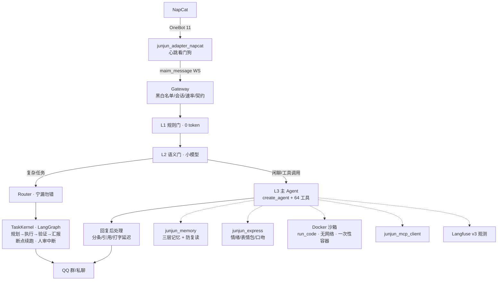

# JunJun_Agent · 君君

一个以 QQ 为前端的通用 Agent：LangChain 1.x `create_agent` + LangGraph 任务内核 + Docker 代码沙箱 + MCP + Langfuse 可观测，单仓 monorepo 分层实现。

北极星：**做一个优秀的通用 agent**——QQ 只是前端之一。会接话也会闭嘴，接得住多步复杂任务（规划→人审→执行→汇报），能跑代码处理真实文件，崩了能从断点接着跑。

> 2026-08-13 换轨说明：原北极星「像真人」降为前端体验指标——分寸感、失败诚实化、记忆隐私边界这些已建成的机械约束继续生效，工程主线转向通用 agent 能力。

## 亮点

- **复杂任务内核（TaskKernel）**：一句「帮我调研 XX 写成报告发我空间」→ LLM 规划拆步 → 逐步执行+验收 → 失败自动重试/局部重规划 → 终态主动汇报。LangGraph SqliteSaver 断点续跑，进程重启不丢单；发布类动作（发说说/发文件/跑代码）执行前私聊管理员审批，**审批通知带实际入参**（代码/参数截断可见，不盲批）。
- **Docker 代码沙箱（run_code）**：一次性容器跑 pandas/matplotlib/python-docx 等 13 个预装包——数据统计、趋势图、中文词云、Word/PDF 报告、二维码都能真做。无网络、只读根 fs、2C/2G 限额、30s 硬杀、非 root、按会话隔离工作区；非管理员跑代码强制走人审。
- **文件入口闭环**：群里发个 xlsx/csv/pdf → 她存进会话工作区 → 沙箱处理 → 结果发回聊天（图片直发，文档传群文件）。「这个表格帮我统计一下」是真闭环，不是嘴上答应。
- **诚实工程**：空输出/工具失败/能力边界全部如实说（「这个我拆不动」），绝不假装做过；工具调用台账驱动的事实核查护栏。
- **三层记忆**：短期窗口 → 话题摘要 → faiss 长期库 + 用户画像/好感度；跨场景隐私边界是**机械强制**（私聊素材绝不进群聊），不靠提示词自觉。
- **决策漏斗省钱**：L1 规则门（0 token）→ L2 小模型语义门 → L3 主 Agent；纯闲聊走轻量模型双腿路由，token 花在刀刃上。

## 架构



| 包 | 职责 |
|---|---|
| `junjun_core` | 网关、配置、数据契约、DB（peewee+WAL）、安全（管理员信任根）、可观测 |
| `junjun_adapter_napcat` | OneBot 11 ↔ maim_message 协议转换，心跳看门狗（断连定责）；群戳一戳 0-token 定额反戳 |
| `junjun_agent` | 决策漏斗（L1/L2/L3）、persona、Router、异步任务反馈闭环（结局主动汇报/工具熔断）、运行期屏蔽名单 |
| `junjun_agent/task_kernel` | 复杂任务状态机：LangGraph 引擎（断点续跑 + 人审 interrupt）+ legacy 双引擎灰度 |
| `junjun_llm` | 任务槽模型工厂：每槽多模型 fallback 链 + 号池（多 key 轮用、死 key 自动剔除重建） |
| `junjun_memory` | 三层记忆（窗口→话题摘要→faiss 长期库）、用户画像、echo 防复读、近重合并整理 |
| `junjun_skills` | 工具注册表（64 工具）+ 26 个插件 + 10 个 md 技能手册（agent 自我认知）+ MCP 工具注入 |
| `junjun_express` | 情绪、表情包（偷图/注册/发送）、黑话、表达学习 |
| `junjun_mcp_client` / `junjun_mcp_server` | MCP 双向：调外部 server + 自建 server |
| `junjun_webui` | FastAPI：配置热改/日志实时流/统计/数据管理 |
| `sandbox/` | 沙箱编排服务（FastAPI）：每跑一次起一个一次性容器，工作区桥接挂载 |

依赖单向向下，层间只走数据契约（`ReplySet`/`InboundMeta`），core 不 import 上层（processor 注入模式）。

## 沙箱与工作区（文件闭环）

```
群里发文件 ──> 适配器解出 file_ref ──> 登记「最近的文件」
      │                                    │
      │            「统计一下这个表格」       │
      ▼                                    ▼
workspace_save_file（50MB 封顶，SSRF 逐跳检查）──> data/workspace/<会话>/
      │
      ▼
run_code：docker run --rm -i --network=none --read-only …
      │  pandas 统计 / matplotlib 出图 / python-docx 写报告
      ▼
workspace_send：图片直发聊天，docx/pdf 传群文件
```

- 容器是唯一安全边界：无网络、只读根文件系统、tmpfs /tmp（noexec）、2C/2G、30s 硬杀、256KB 输出封顶、并发信号量 4、非 root、每跑一次性容器。
- 编排层辅助防线：workdir resolve 归属断言（挡 `..` 穿越）、可选共享 token 鉴权、ast 静态预检（禁 os/sys/subprocess 等）、非管理员强制人审。
- `fetch_page` 网页深读：SSRF 检查拒私网/回环/保留地址，重定向**逐跳复查**（302 到内网必拦）。

## 安全模型

- **管理员信任根**：`ADMIN_QQ` 硬编码读取（.env，配置/WebUI/聊天内容都改不了权限）；敏感工具（跨会话查询/发说说/跑代码）工具体内硬校验，不依赖 prompt 自觉。
- **人审门**：发布类/沙箱类步骤执行前 interrupt 挂起，私聊管理员「发/算了」裁决，超时默认跳过；审批恢复按**任务提交者身份**继续执行（不借管理员身份）。
- **越权上报**：非管理员碰管理员工具，自动私聊上报管理员。
- **密钥卫生**：.env / 号池文件 / 各插件 config.toml 全部 gitignore；日志与展示只给 key 前缀。
- **生产库只读纪律 + 每日备份**：`scripts/backup_db.py`（sqlite3 .backup API，WAL 安全，留 7 代，同盘告警）。
- **群管防护**：运行期屏蔽名单（防 bot 间互相回复死循环）、群戳一戳日定额 0-token 反戳、速率限制令牌桶。

## 模型策略（任务槽 × fallback 链）

按调用频率和价值分槽——高频槽关思考省钱省延迟，低频高价值槽开思考换质量：

| 槽 | 用途 | 模型链（示例配置） |
|---|---|---|
| `agent` | 闲聊决策（高频） | ***REMOVED***（关思考）→ Qwen3.5-397B → ***REMOVED*** |
| `thinker` | 复杂任务规划 / 深度研究（低频） | ***REMOVED***（开思考）→ Qwen3.5 → DS |
| `gate` / `utils` / `utils_small` | 语义门 / 杂务 / 步骤验收 | ***REMOVED*** |
| `vlm` | 识图 / 表情包注册 | ***REMOVED*** |

每条链支持多 key 号池轮用，key 欠费/失效自动剔除并重建 fallback 链；厂商特定参数（如 GLM 关思考 `thinking.type=disabled`）按槽位条目透传。

## 质量保障

- **单元回归**：`uv run python -m pytest tests/ -q`（**1750+** 条，全 0-token）——铁律：凡是加宽命中面的改动（词表/关键词/守卫 pattern），必须同 commit 带「不该命中的日常句子」误判回归断言。
- **golden 决策评测**（真实 LLM）：`scripts/eval_golden.py`（对话通道）+ `scripts/eval_tasks.py`（任务通道，30+ case 含人审模拟/僵尸隔离/评委校准）。
- **功能体检**：`uv run python scripts/functional_check.py --pytest`。
- **全链路 E2E**：`scripts/test_e2e_fake_napcat.py`（fake NapCat）。
- 事故驱动学习：每次生产事故落成规则 + 回归测试 +  dated 踩坑文档。

## 快速开始

```bash
# 1. 依赖（Python 3.11+，uv）
uv venv && uv sync

# 2. 配置
copy .env.example .env
#    必填: JUNJUN_QQ_ACCOUNT（bot 的 QQ 号）、DS_BASE_URL / DS_MODEL / DEEPSEEK_API_KEY
#    建议: SILICONFLOW_API_KEY（embedding 向量记忆，缺省降级关键词检索）
#    可选: VLM_*（识图）、LANGFUSE_*（可观测）、DOUBAO_TTS_API_KEY（语音）、
#          WEBUI_TOKEN、SANDBOX_TOKEN（沙箱鉴权）、BACKUP_DIR（备份目录）
copy config\bot_config.toml.example config\bot_config.toml

# 3. NapCat：onebot11 配置 websocketClients 指向 ws://127.0.0.1:8095
#    （messagePostFormat=array, reportSelfMessage=false）

# 4. 启动三件套（顺序：NapCat → adapter → bot）
uv run python scripts/napcat_watchdog.py    # NapCat 看门狗（掉线自拉）
uv run python scripts/run_adapter.py        # OneBot 适配器
uv run python scripts/run_junjun.py         # 网关 + Agent 主程序

# 5.（可选）代码沙箱：docker build -t junjun-sandbox sandbox/ 后
uv run uvicorn sandbox.server:app --host 127.0.0.1 --port 8100

# 6.（可选）WebUI: .env 设 WEBUI_ENABLED=true → http://127.0.0.1:8002
# 7.（建议）每日备份：schtasks 注册 scripts/backup_db.py（详见脚本 docstring）
```

## 配置说明

- `config/bot_config.toml` — 人设/回复后处理/情绪/表情包/提醒/任务内核（注释即文档，参考 `.example`，不入库）
- `config/model_config.toml` — 任务槽模型链（每槽多模型 fallback + 号池）
- `config/mcp_servers.toml` — MCP server 声明（stdio，`${REPO_ROOT}` 插值）
- `.env` — API key 与账号（不入库）

复杂任务内核（`[task_kernel]`）：`engine = "langgraph"` 启用断点续跑与人审；`approval_actions`（默认 `send_feed`）+ 非管理员的 `run_code` 步骤执行前私聊管理员等批准，超时默认跳过。深度研究（`[deep_research]`）与热点日报（`[daily_report]`，每天选题→深研→写稿→人审→发 QQ 空间）同样走 LangGraph 管线，崩溃后从断点续跑。

## 故障排查

| 现象 | 排查 |
|---|---|
| QQ 无响应 | ① netstat 查 8095 是否被旧 adapter 占用 ② adapter 日志是否连上 8092 ③ 名单过滤（启动日志打印生效名单）④ 对方是否在屏蔽名单（/屏蔽列表 查） |
| 双回复 | 有第二个 adapter 进程在跑（可能开机自启），杀掉 |
| 全部沉默 | 群聊只有 @/直呼才回（设计如此）；日志 DEBUG 看决策门拦截原因 |
| 跑代码被拒 | 沙箱服务未启动或 SANDBOX_TOKEN 不一致；非管理员需走人审 |
| MCP 工具缺失 | server 子进程必须 `-u`；日志看连接失败原因（10s 超时降级） |
| Langfuse 无 trace | `LANGFUSE_ENABLED=true` + 自托管服务可达；SDK 降级不影响主流程 |

## License

MIT
