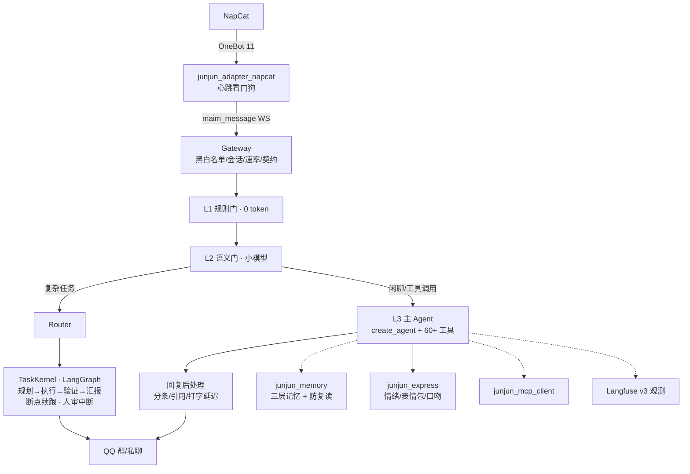

# JunJun_Agent · 君君

像真人的 QQ 机器人。从零搭建的现代 Agent 架构：LangChain 1.x `create_agent` + LangGraph 任务内核 + Function Calling + MCP + Langfuse 可观测，monorepo 分层。

北极星指标：**像真人**——会接话也会闭嘴，会答应也会认怂，接得住复杂任务，跑崩了能接着跑。

## 架构



| 包 | 职责 |
|---|---|
| `junjun_core` | 网关、配置、数据契约、DB（peewee+WAL）、安全（管理员信任根）、可观测 |
| `junjun_adapter_napcat` | OneBot 11 ↔ maim_message 协议转换，心跳看门狗（断连定责） |
| `junjun_agent` | 决策漏斗（L1/L2/L3）、persona、Router、异步任务反馈闭环（结局主动汇报/工具熔断） |
| `junjun_agent/task_kernel` | 复杂任务状态机：LangGraph 引擎（SqliteSaver 断点续跑 + 发布类人审 interrupt）+ legacy 双引擎灰度 |
| `junjun_llm` | 任务槽模型工厂：每槽多模型 fallback 链 + 硅基号池（多 key 轮用、死 key 自动剔除重建） |
| `junjun_memory` | 三层记忆（窗口→话题摘要→faiss 长期库）、用户画像、echo 防复读、夜间近重合并整理 |
| `junjun_skills` | 工具注册表（60+ 工具）+ 26 个插件（画图/搜索/B站/订阅/网盘/TTS/热点日报…）+ MCP 工具注入 |
| `junjun_express` | 情绪、表情包（偷图/注册/发送）、黑话、表达学习 |
| `junjun_mcp_client` / `junjun_mcp_server` | MCP 双向：调外部 server + 自建 server |
| `junjun_webui` | FastAPI：配置热改/日志实时流/统计/数据管理 |

依赖单向向下，层间只走数据契约（`ReplySet`/`InboundMeta`），core 不 import 上层（processor 注入模式）。

## 模型策略（任务槽 × fallback 链）

按调用频率和价值分槽——高频槽关思考省钱省延迟，低频高价值槽开思考换质量：

| 槽 | 用途 | 模型链 |
|---|---|---|
| `agent` | 闲聊决策（高频） | ***REMOVED***（关思考）→ Qwen3.5-397B → ***REMOVED*** |
| `thinker` | 复杂任务规划 / 深度研究（低频） | ***REMOVED***（开思考）→ Qwen3.5 → DS |
| `gate` / `utils` / `utils_small` | 语义门 / 杂务 | ***REMOVED*** |
| `vlm` | 识图 / 表情包注册 | ***REMOVED*** |

每条链支持多 key 号池轮用，key 欠费/失效自动剔除并重建 fallback 链；厂商特定参数（如 GLM 关思考 `thinking.type=disabled`）按槽位条目透传。

## 质量保障

- **单元回归**：`uv run python -m pytest tests/ -q`（1500+ 条，含大量「误判回归」——凡是加宽命中面的改动必须带不该命中的日常句子断言）
- **golden 决策评测**（真实 LLM）：`uv run python scripts/eval_golden.py`——34 条端到端 case，改 prompt/工具掩码/模型前后各跑一次对比
- **功能体检**：`uv run python scripts/functional_check.py --pytest`
- **全链路 E2E**：`.venv\Scripts\python.exe scripts\test_e2e_fake_napcat.py`（fake NapCat）

## 快速开始

```bash
# 1. 依赖（Python 3.11+，uv）
uv venv && uv pip install -e .

# 2. 配置
copy .env.example .env
#    必填: JUNJUN_QQ_ACCOUNT（bot 的 QQ 号）、DS_BASE_URL / DS_MODEL / DEEPSEEK_API_KEY（任务模型）
#    建议: SILICONFLOW_API_KEY（embedding 向量记忆，缺省降级关键词检索）
#    可选: VLM_*（多模态识图）、LANGFUSE_*（可观测）、DOUBAO_TTS_API_KEY（语音）、WEBUI_TOKEN

# 3. NapCat：确认 onebot11 配置里 websocketClients 指向 ws://127.0.0.1:8095
#    （messagePostFormat=array, reportSelfMessage=false）
#    ⚠️ 确认没有其他 adapter 进程占用 8095（netstat -ano | findstr 8095）

# 4. 启动（两个窗口）
.venv\Scripts\python.exe scripts\run_junjun.py                 # 网关+Agent
.venv\Scripts\python.exe -m junjun_adapter_napcat.main         # Adapter

# 5.（可选）WebUI: .env 设 WEBUI_ENABLED=true → http://127.0.0.1:8002
```

## 配置说明

- `config/bot_config.toml` — 人设/回复后处理/情绪/表情包/主动/提醒/复杂任务内核（注释即文档，参考 `.example`）
- `config/model_config.toml` — 任务槽模型链（每槽多模型 fallback + 号池）
- `config/mcp_servers.toml` — MCP server 声明（stdio，`${REPO_ROOT}` 插值）
- `.env` — API key 与账号（不入库）

复杂任务内核（`[task_kernel]`）：`engine = "langgraph"` 启用断点续跑与人审；`approval_actions` 里的动作（默认 `send_feed`）执行前会私聊管理员等批准，超时默认跳过。深度研究（`[deep_research]`）与热点日报（`[daily_report]`，每天选题→深研→写稿→人审→发 QQ 空间）同样走 LangGraph 管线，崩溃后从断点续跑，审批词同为「发/算了」。

## 故障排查

| 现象 | 排查 |
|---|---|
| QQ 无响应 | ① netstat 查 8095 是否被旧 adapter 占用 ② adapter 日志是否连上 8092 ③ 名单过滤（启动日志打印生效名单） |
| 双回复 | 有第二个 adapter 进程在跑（可能开机自启），杀掉 |
| 全部沉默 | 群聊只有 @/直呼才回（设计如此）；日志 DEBUG 看决策门拦截原因 |
| MCP 工具缺失 | server 子进程必须 `-u`；日志看连接失败原因（10s 超时降级） |
| Langfuse 无 trace | `LANGFUSE_ENABLED=true` + 自托管服务可达；SDK 降级不影响主流程 |

## License

MIT
